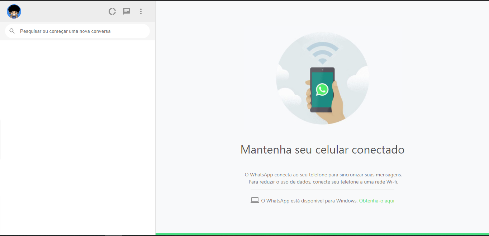

<h1 align="center">WHATSAPP WEB CLONE - REACT</h1>

Clone do whatsapp web para usar de portifolio

 
<h1 align="center">
    <a href="https://pt-br.reactjs.org/">🔗 React</a>
</h1>

🚀 lib para construir interfaces do usuário com componentes reutilizáveis

<h4 align="center"> 
	🚧 Em construção...  🚧
</h4>

<!-- 

 <a href="#objetivo">Objetivo</a> •
 <a href="#roadmap">Roadmap</a> • 
 <a href="#tecnologias">Tecnologias</a> •

 -->

 Este é o clone do whatsapp web, feito utilizando reactjs e firebase

### Features 

- [x] Login com google
- [ ] Login com facebook
- [x] Informações do usuario
- [x] Abrir novo chat
- [x] Chat ao vivo
- [x] Emojis
- [ ] Enviar foto e audio

<h2 align="center">Galeria de imagens</h2>

Login com google

Tela inicial

Nova conversa

Digitando nova conversa

Digitando emojis

Chat

